<!--
Copyright Advanced Micro Devices, Inc.

SPDX-License-Identifier: MIT
-->

# Work Instruction Generator

**On-Premise GenAI Solution for Machine-State-Aware Work Instruction Authoring**

*Built for manufacturing deployments on 4-GPU AMD Radeon AI PRO R9700S with the AMD ROCm 7.2.3 stack.*

<div align="center">
  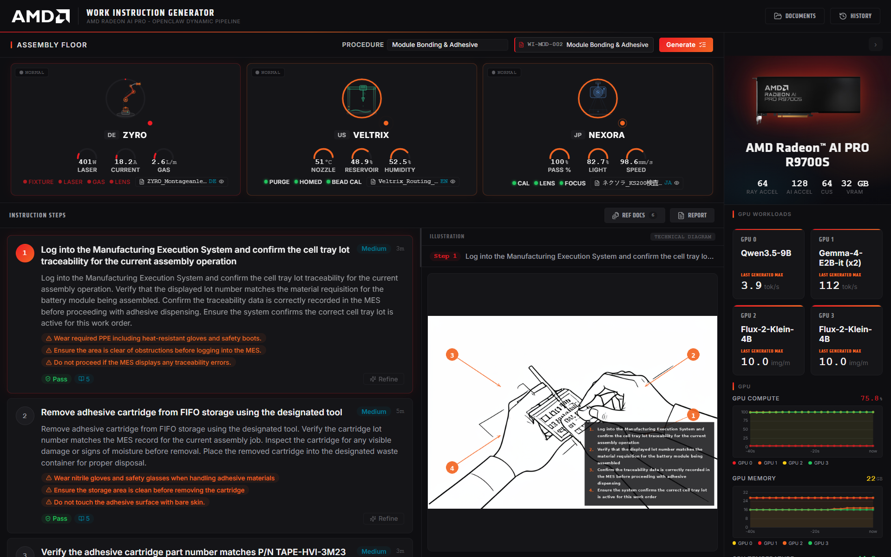
  <p><em>Main dashboard overview</em></p>
</div>

---

## Table of Contents

- [Introduction](#introduction)
- [Key Features](#key-features)
- [Prerequisites](#prerequisites)
- [Deploying the Solution](#deploying-the-solution)
- [User Interface and Flow](#user-interface-and-flow)
- [Operations](#operations)
- [Advanced Configuration](#advanced-configuration)
- [Known Issues](#known-issues)
- [Documentation](#documentation)
- [Disclaimer](#disclaimer)

---

## Introduction

On a real production line, work instructions live in three places that never agree with each other: the OEM manual (often in the vendor's own language), the plant SOP binder, and whatever the senior operator actually does when the manual is wrong. This solution delivers a **unified, on-premise work-instruction generation platform** that harmonizes that mismatched documentation into step-by-step, illustrated instructions, authored by a local Gemma LLM, illustrated by a local Flux diffusion model, and orchestrated by a pipeline of specialized agents (source, authoring, illustration, and export) exposed as MCP tools through OpenClaw, with every step grounded in **live machine state** pulled from the shop floor (via a Sparkplug B / MQTT machine simulator standing in for a real OPC-UA/MES/SCADA feed) and gated by hard safety interlocks (LOTO, PPE, purge-complete, fixture-locked) evaluated per-station before it's authored. Every instruction traces back to its source manual or SOP.

All 9 EV battery pack assembly procedures (cell inspection, module bonding, laser welding, thermal interface assembly, HV integration, enclosure sealing, leak testing, hi-pot testing, EOL functional test) across 7 stations are loaded and selectable from the machine floor, but the pipeline itself is vendor/plant-agnostic, so swap in a different manual/SOP set and station list to point it at another line.

---

## Key Features

| Feature | Description |
| ------- | ----------- |
| **Privacy-Preserving On-Prem AI Infrastructure** | All AI runs locally on 4× AMD Radeon AI PRO R9700S GPUs (`Qwen/Qwen3.5-9B`, `google/gemma-4-E2B-it` ×2, and `Flux-2-Klein-4B-GGUF` ×2), so manuals, SOPs, and generated instructions never leave the plant network. |
| **Automated Multi-Agent Harmonization Engine** | Specialized agents ingest mismatched multi-vendor OEM manuals (German ZYRO, Japanese Nexora, US Veltrix), normalize vendor terminology to plant standard, and re-render source figures into one consistent technical-diagram style via Flux. |
| **State-Aware Dynamic Instruction Delivery** | Steps are authored against station telemetry (nozzle temperature, lens status, HV de-energized state — live for 3 simulated station) and hard safety interlocks (LOTO, PPE, purge, fixture, lens), blocking or passing steps accordingly, on demand for any station. |
| **Tribal Knowledge Capture & Operational Continuity** | A step can be refined with a free-text instruction; the fix is captured as tribal knowledge via the review chat and the step (and its illustration) is regenerated in place. |

---

## Prerequisites

This solution was deployed and tested on the following hardware:

**Hardware**

| Component | Specification |
| --------- | ------------- |
| **CPU** |  AMD Ryzen Threadripper PRO 9995WX 96-Cores  |
| **GPU** | 4× AMD Radeon AI PRO R9700S (32 GB VRAM each, gfx1201) |
| **System RAM** | 256 GB DDR5 |
| **Storage** | 500 GB free NVMe SSD (Docker images, model weights, generated artifacts) |

**Software**

| Component | Version |
| --------- | ------- |
| **Operating System** | Ubuntu 24.04 LTS |
| **Linux Kernel** | 6.17.0-29-generic |
| **Docker Engine** | 25.0+ |
| **Docker Compose** | v2.20+ |
| **ROCm** | 7.2.3 |

> **4 GPUs are required.** 

**Internet connection**

An internet connection is required for the first build and boot, to pull Docker base images and download model weights (Qwen3.5-9B, Gemma-4-E2B-it, Flux-2-Klein-4B-GGUF), roughly 50 GB in total. After the initial download, all assets are served locally and no internet access is required for day-to-day operation. No Hugging Face token is required since all models used are ungated.

---

## Deploying the Solution

### 1. Clone the repository

```bash
git clone <repository-url>
cd <cloned-repository>
```

---

### 2. Verify ROCm and GPU visibility

```bash
rocm-smi
```

Confirm all 4 GPUs appear before proceeding.

---

### 3. Start the stack

The recommended path is the guided `setup.sh` script. It checks all prerequisites, writes and validates `.env` (including secrets, which are never given an insecure default), and builds and starts every container:

```bash
./scripts/setup.sh
```

If `.env` is already configured and you only need to rebuild and launch:

```bash
git lfs pull   # fetch OEM manual PDFs 
docker compose up -d --build
```

Either path brings up:

- **Infrastructure**: PostgreSQL, NATS, etcd, RustFS, Milvus, Mosquitto (MQTT)
- **Metrics**: AMD device metrics exporter, node-exporter, Prometheus
- **AI services**: Qwen3.5-9B (GPU 0), Gemma-4-E2B-it ×2 (GPU 1), Lemonade/Flux ×2 (GPU 2, GPU 3)
- **Application**: machine simulator, ingest RAG service, `wig-mcp-tools`, OpenClaw gateway, WIG API, React frontend

> **First boot** downloads ~45 GB of model weights (Qwen3.5-9B ~19 GB, Gemma-4-E2B-it ~10 GB, Flux-2-Klein-4B + text encoder/VAE ~15 GB). Expect **~30 minutes on a fast link and several hours on a slow one**; later bring-ups load from the host cache in a few minutes. Monitor with `docker compose ps` and `docker compose logs -f inference llm-inference-1 lemonade-1`.
>
> If a model server is still downloading when its healthcheck grace period ends, `docker compose up -d` exits with **`dependency failed to start: container … is unhealthy`**. This is expected on a first run and is **not a crash**. `setup.sh` detects it, waits for the model servers to become healthy, and then starts the remaining services. On the manual path, wait until `docker compose ps` shows the model servers healthy and run `docker compose up -d` again. See [Known Issues](#known-issues).
>
> **Every stack bring-up** takes a total of **15–20 minutes** while the ingest RAG service ingests all OEM manual/SOP documents into Milvus. Monitor with `docker compose logs -f oem-ingest`.

---

### 4. Verify deployment

```bash
docker compose ps

# Frontend health (only externally exposed port)
curl http://localhost:5173
```

---

### 5. Access the application

Use one of the following based on where the stack is running:

<ol>
  <li>
    <strong>Local deployment (same workstation)</strong>
    <ol type="a">
      <li>No port forwarding required.</li>
      <li>Open <a href="http://localhost:5173">http://localhost:5173</a>.</li>
    </ol>
  </li>
   <li>
    <strong>Remote server deployment (access over SSH)</strong>
    <p>Forward port <code>5173</code> to your local machine.</p>
    <ol type="i">
      <li>
        <strong>VS Code Ports panel</strong>
        <ol type="a">
          <li>Open the Command Palette (<code>Ctrl+Shift+P</code> / <code>Cmd+Shift+P</code>).</li>
          <li>Select <strong>Forward a Port</strong>.</li>
          <li>Add <code>5173</code>.</li>
          <li>Open <a href="http://localhost:5173">http://localhost:5173</a> locally.</li>
        </ol>
      </li>
      <li>
        <strong>SSH local port forwarding</strong>
        <ol type="a">
          <li>Run:<pre><code>ssh -L 5173:localhost:5173 &lt;user&gt;@&lt;remote_host&gt;</code></pre></li>
          <li>Open <a href="http://localhost:5173">http://localhost:5173</a> locally.</li>
        </ol>
      </li>
    </ol>
  </li>
</ol>

Only the frontend port is published to the host; Postgres, NATS, Milvus, the agent containers, and the model servers are reachable only on the internal `wig-net` docker network.

---

## User Interface and Flow

Open [http://localhost:5173](http://localhost:5173).

<div align="center">
  
  <p><em>Main dashboard overview</em></p>
</div>

### 1. Browse the machine floor and select a procedure

The **Machine Floor** panel streams live station telemetry over SSE for 3 stations with dedicated gauges (module bonding dispenser, tab/busbar welder, cell/optical inspector). A procedure dropdown lets you pick any of the 9 loaded EV assembly procedures; picking one scopes the workspace to that procedure's station and source documents.

<div align="center">
  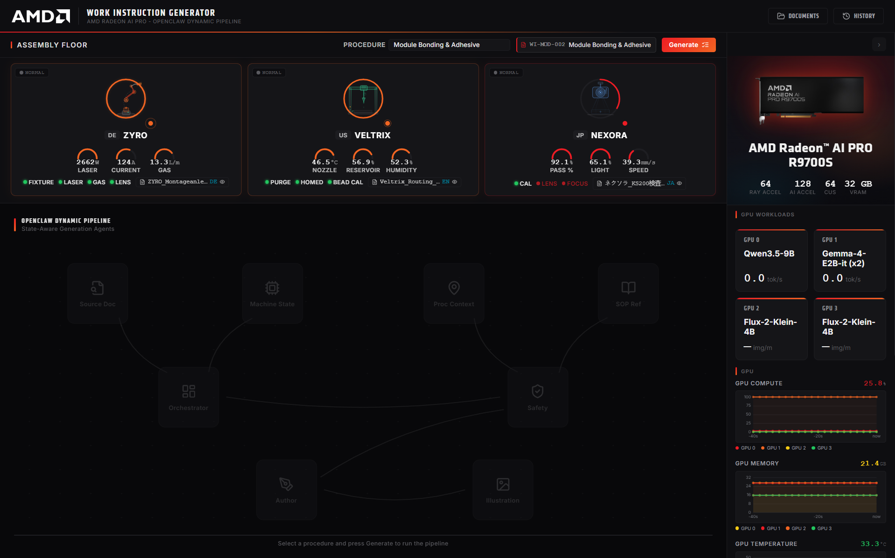
  <p><em>Machine floor with live station status and procedure selector</em></p>
</div>

---

### 2. Generate the work instructions

Clicking generate creates a document for the selected procedure and starts a background job. The **Pipeline Tracker** animates through the orchestrator's stages (loading OEM manual/SOP sources and RAG context, then authoring each step) while polling generation status live.

<div align="center">
  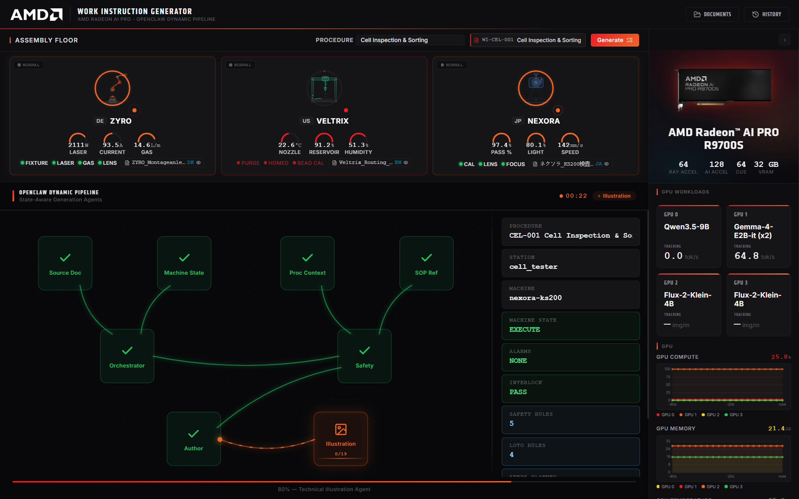
  <p><em>Live pipeline tracker during instruction generation</em></p>
</div>

---

### 3. Review the procedure's steps and machine-state-aware interlocks

Once generation finishes, the **Step Viewer** is where you view the selected procedure: it lists every authored step as a card (instructions, tools/parts, interlock and citation badges). Selecting a step reveals its illustration in the right-hand column — every step gets a generated illustration, except interlock-blocked prerequisite steps. For stations with live simulator state, each step reflects the hard interlocks evaluated at authoring time. The **Ref Docs** button on the workspace header lists every source SOP/manual/procedure document cited by the current work instruction generation.

<div align="center">
  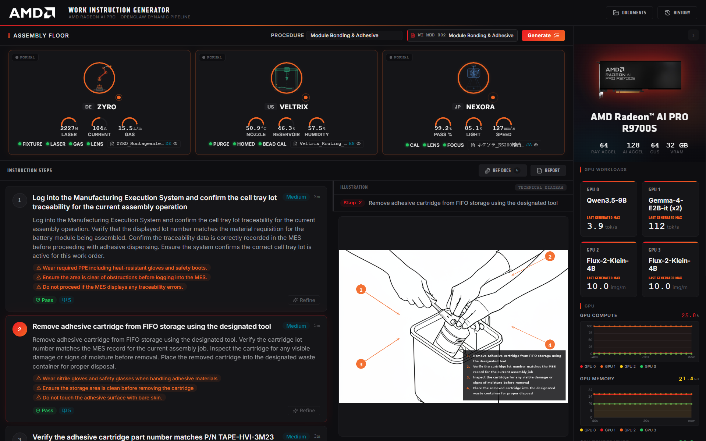
  <p><em>Step list with selected step's technical illustration</em></p>
</div>

Each machine card on the **Machine Floor** has a **FAULT MODE / NORMAL** toggle. Switching a station into fault mode forces its simulated state to `Aborted`, raises critical alarms (e.g. an HV interlock fault), and clears its safety readiness flags. Generating instructions for that station then produces lockout/tagout (LOTO) prerequisite steps ahead of the normal procedure steps, each marked with a red "Blocked" badge in the Step Viewer instead of the usual green "Pass". This is the quickest way to see the interlock/lockout behavior without waiting for a real fault.

<div align="center">
  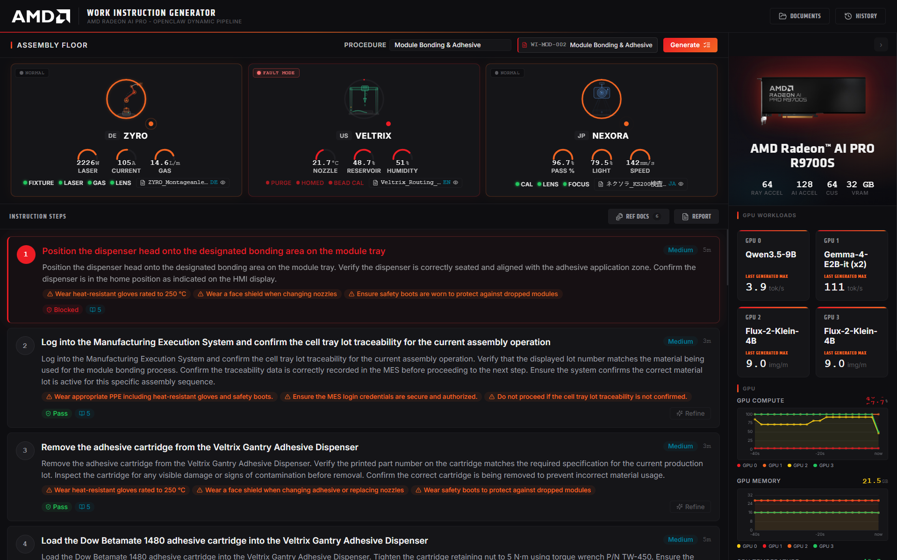
  <p><em>Fault mode triggers LOTO prerequisite steps with a "Blocked" badge</em></p>
</div>

---

### 4. Refine a step and capture tribal knowledge

Each step card has a **Refine** control: type a correction or workaround and submit. The instruction is sent to the refinement chat (captured as tribal knowledge), the step text is regenerated in place, and if the step had an illustration, a new one is generated and swapped in; a **Refined** badge marks the updated card.

<div align="center">
  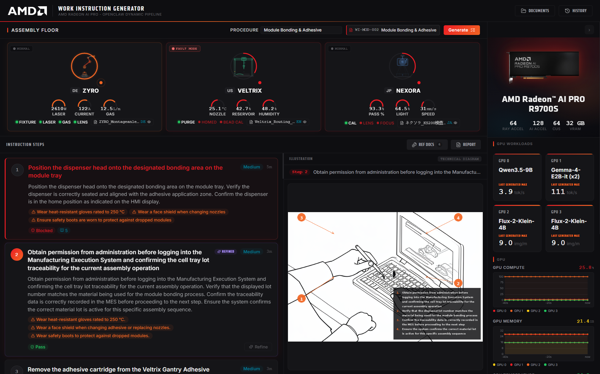
  <p><em>Inline step refinement and tribal-knowledge capture</em></p>
</div>

---

### 5. Preview and export the report

The **Report** button opens a preview of the full document alongside the **Export Bar**. 

<div align="center">
  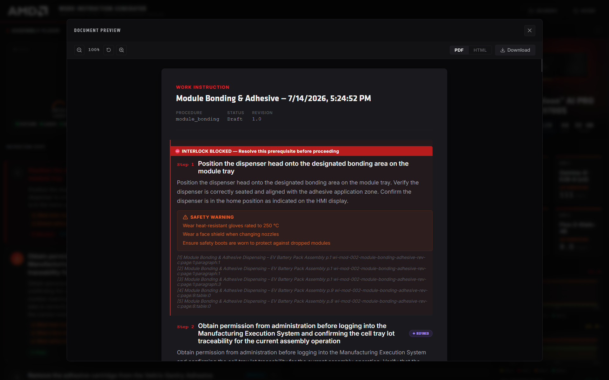
  <p><em>Report preview with export format and language controls</em></p>
</div>

Choose an output format (PDF or HTML), then download the document.

<div align="center">
  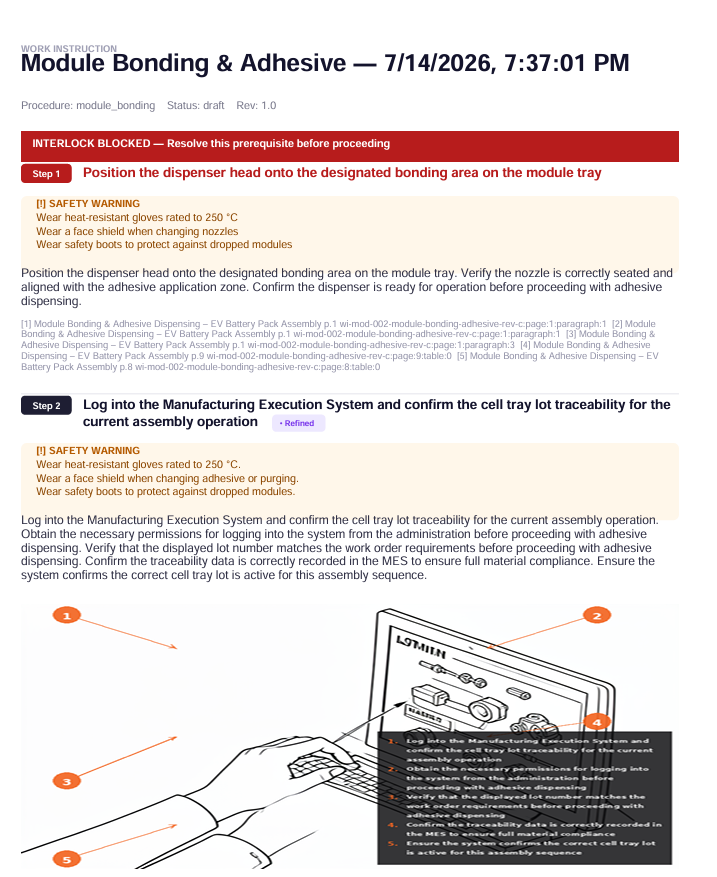
  <p><em>PDF report view</em></p>
</div>

---

### 6. Browse documents and history

The **Documents** button (top bar) opens a popup listing all bundled SOPs (lockout/tagout protocols, plant terminology, interlock rules, HV safety, quality standards, material handling, troubleshooting trees, approved workarounds). 

<div align="center">
  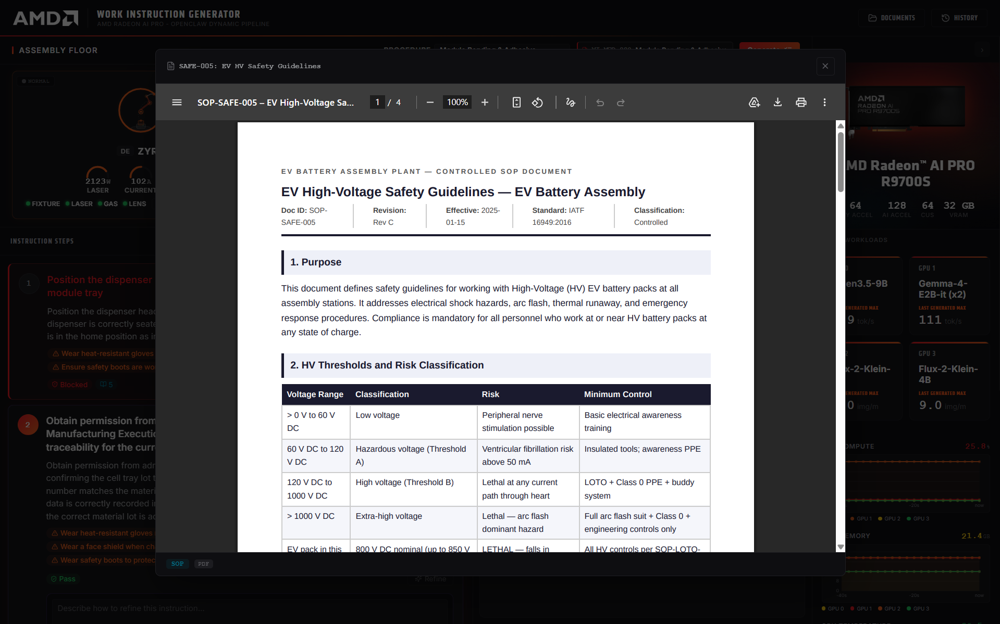
  <p><em>SOP document view</em></p>
</div>


The **History** button opens a drawer of previously generated documents; selecting one opens a read-only preview of its steps.

<div align="center">
  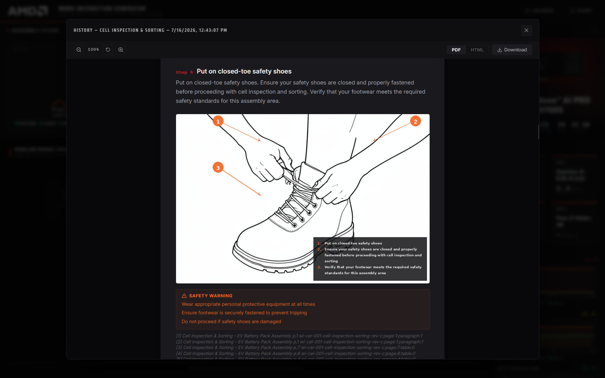
  <p><em>Generation history document view</em></p>
</div>

---

### 7. Monitor GPU and generation metrics

The collapsible **Metrics** panel on the right shows live GPU and CPU utilization metrics as well as the solution metrics for all of the models (tokens/sec, images/min).

<div align="center">
  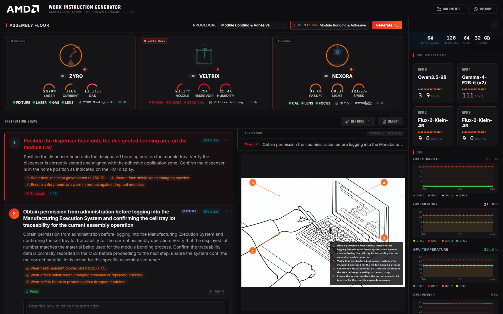
  <p><em>Live GPU and generation metrics panel</em></p>
</div>

---

## Operations

### Logs

```bash
docker compose logs -f                            # all services
docker compose logs -f wig-api                     # FastAPI backend
docker compose logs -f wig-mcp-tools                # MCP tool server
docker compose logs -f inference llm-inference-1 llm-inference-2   # LLM inference
docker compose logs -f lemonade-1 lemonade-2        # illustration generation
docker compose logs -f machine-simulator             # simulated shop-floor telemetry
```

### Stopping

```bash
docker compose down -v                
```

---

## Advanced Configuration

Full reference of every variable understood by the stack (see `.env.example`):

| Variable | Default | Required | Description |
| -------- | ------- | -------- | ----------- |
| `POSTGRES_PASSWORD` | — | Yes | Postgres password; set interactively by `setup.sh` (rejects weak/default values) |
| `DATABASE_URL` | — | Yes | Full DSN used by `wig-api` and `wig-mcp-tools`; built by `setup.sh` from `POSTGRES_PASSWORD` |
| `RUSTFS_ACCESS_KEY` | — | Yes | RustFS / Milvus object store access key |
| `RUSTFS_SECRET_KEY` | — | Yes | RustFS / Milvus object store secret key |
| `HF_CACHE_DIR` | — | Yes | Host path bind-mounted as the HuggingFace model cache (Qwen3.5-9B, Gemma-4-E2B-it) |
| `LEMONADE_LLAMA_DIR` | — | Yes | Host path bind-mounted as the Lemonade llama build directory |
| `LEMONADE_RECIPE_DIR` | — | Yes | Host path bind-mounted as the Lemonade/Flux model cache |
| `GPU_INFERENCE_DEVICE` | `renderD129` | Yes | `/dev/dri` render node for GPU 0 (Qwen3.5-9B) |
| `GPU_GEMMA_DEVICE` | `renderD130` | Yes | `/dev/dri` render node for GPU 1 (Gemma-4-E2B-it ×2, shared) |
| `GPU_LEMONADE1_DEVICE` | `renderD128` | Yes | `/dev/dri` render node for GPU 2 (Flux instance 1) |
| `GPU_LEMONADE2_DEVICE` | `renderD131` | Yes | `/dev/dri` render node for GPU 3 (Flux instance 2) |
| `VIDEO_GID` | `44` | No | GPU device group GID for `/dev/dri` access; auto-detected by `setup.sh` |
| `RENDER_GID` | `109` | No | GPU device group GID for `/dev/kfd` access; auto-detected by `setup.sh` |
| `WIG_USE_OPENCLAW_GATEWAY` | `true` | No | `true` routes `wig-api` through `wig-mcp-tools` directly (validated path); `false` falls back to the legacy `agent-*` containers |
| `OPENCLAW_GATEWAY_TOKEN` | — | Yes | Bearer token for the OpenClaw gateway's HTTP API; auto-generated by `setup.sh` if left blank |

---

## Known Issues

### Application

- **First model load is slow.** Qwen3.5-9B, Gemma-4-E2B-it, and Flux/Lemonade report `starting` (and, once their start period runs out, `unhealthy`) while ~45 GB of weights download and load onto GPU. On a slow link, Lemonade/Flux can take well over its 60-minute start period.
- **`dependency failed to start` on first run is not a crash.** `docker compose up -d` waits for `service_healthy` dependencies and gives up when a model server is still downloading, leaving its dependents (e.g. `wig-lemonade-lb`) in `created`. Containers keep downloading in the background. `setup.sh` handles this automatically: it fails only if a container has actually exited with an error or was never created; otherwise it waits (default up to 240 minutes) and then runs `docker compose up -d` again. Tunables:

  | Variable | Default | Effect |
  | -------- | ------- | ------ |
  | `SETUP_WAIT_FOR_HEALTHY` | `1` | `0` returns immediately instead of waiting; run `docker compose up -d` yourself once models are healthy |
  | `SETUP_STARTUP_TIMEOUT_MIN` | `240` | Maximum minutes to wait for model servers before handing back with instructions |
  | `SETUP_STARTUP_POLL_S` | `30` | Seconds between progress checks |

  Pressing Ctrl+C during the wait is safe: containers keep running, and `docker compose up -d` finishes the bring-up later.
- **Document ingestion is slow.** `oem-ingest` can take up to 15–20 minutes to ingest all OEM manual/SOP documents into Milvus on every stack bring-up. Monitor with `docker compose logs -f oem-ingest`.

---

## Documentation

| Document | Description |
| -------- | ----------- |
| **[Design](docs/design.md)** | Solution architecture, component glossary, and GPU/model layout |
| **[Release Notes](RELEASE_NOTES.md)** | Version history and changes across releases |

---

## Disclaimer

### Performance

Performance varies by hardware and software configurations, including testing conditions, system settings, application complexity, data volume, software versions, libraries used, and other factors. Any performance or benchmarking results referenced in this repository are provided for informational purposes only and should not be interpreted as a guarantee of actual performance.

### Outcome

This solution is provided as a technology demonstration and has been validated against the sample OEM manuals, plant SOPs, and procedure documents bundled in `work_instruction_generator/oem_ingest/documents/` (`machine_manuals/`, `sop_docs/`, `procedure_docs/`). The 9 loaded EV assembly procedures, their station telemetry, and SOP documents are illustrative and used solely to exercise the generation, interlock-evaluation, and export pipeline. They do not represent any real manufacturer, plant, or production line and should not be relied upon for real-world manufacturing, safety, or compliance decision-making. Generated work instructions have not been validated against a real safety program and must not be used on an actual production floor without independent engineering and safety review. All provided files are supplied "as-is" without warranties. The creators are not responsible for any outcomes resulting from use of these materials outside their intended demonstration context.
