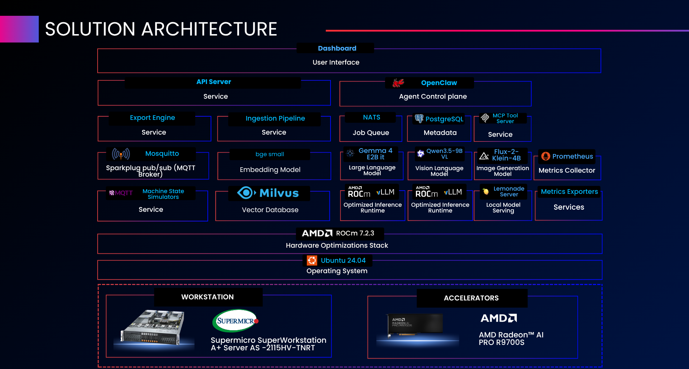
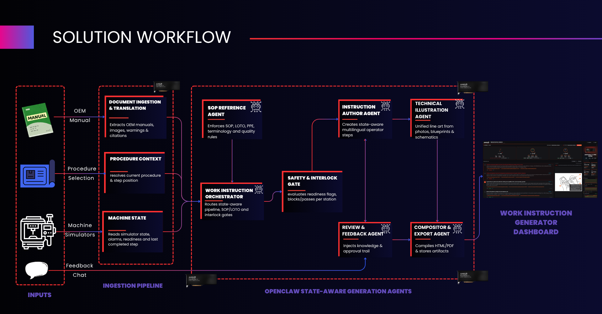

<!--
Copyright Advanced Micro Devices, Inc.

SPDX-License-Identifier: MIT
-->

## Solution Architecture

  
  
<em>Layered solution stack — accelerators → ROCm → runtimes → models → services → dashboard</em>

### Component Glossary

| Layer | Component | Role |
|-------|-----------|------|
| **User Interface** | **Dashboard** | Document creation, source upload, live machine-floor panel, step viewer with illustrations, chat/refinement, preview pane, export bar, and a live GPU/system metrics panel |
| **Application Services** | **Application backend** | Handles documents, source uploads, station data, instruction generation, step regeneration, chat/refinement, illustrations, and export; streams live updates to the dashboard |
| | **Agent orchestration layer** | Exposes the orchestrator and each specialized agent as callable tools, coordinating the generation pipeline end to end |
| | **OEM ingestion** | Parses OEM manuals and images, analyzes figures, chunks the content, and stores it for retrieval; runs automatically at startup |
| | **Retrieval (RAG) service** | Looks up relevant SOP, LOTO, terminology, and tribal-knowledge context for a procedure at generation time |
| | **Multi-agent runtime** | Hosts the authoring agent's chat/skill flows |
| | **Relational database** | Stores documents, steps, revisions, exports, sources, illustrations, chat, tribal knowledge, machine-state snapshots, and interlock evaluations |
| | **Event bus** | Lightweight pub/sub for event fan-out (machine-state and job updates) between services |
| **AI Models** | **Instruction-authoring LLM (×2)** | Generates instruction text; degrades to a labeled auto-draft if temporarily unreachable |
| | **Vision/translation LLM** | Analyzes OEM schematic images, translates instructions into other languages, and summarizes step scenes for illustration prompts |
| | **Illustration model (×2)** | Generates technical-diagram illustrations for each step; pre-warmed at startup |
| | **Embedding model** | Embeds OEM manual/SOP text chunks and procedure-context queries for retrieval |
| **Inference Runtimes** | **LLM inference runtime** | Hosts the instruction-authoring and vision/translation models |
| | **Image-generation runtime (×2)** | Hosts the illustration model |
| | **Load balancers** | Spread requests across the paired LLM and illustration model instances |
| **Storage & Telemetry** | **Vector store** | Holds SOP and OEM-manual chunk embeddings for retrieval, backed by object storage and a metadata store |
| | **Metrics stack** | Collects and exposes GPU utilization, VRAM, temperature, power, and host CPU/RAM/disk/network statistics on a live dashboard |
| **Hardware Optimizations** | **GPU compute stack** | Runs all inference workloads on-premise across four accelerators, tuned for lower-latency inference |
| **Operating System** | **Ubuntu 24.04 LTS** | Validated host OS for the deployment |
| **Accelerators** | **4× GPU (32 GB VRAM each)** | One dedicated to vision + translation, one (shared across two instances) to instruction authoring, and two to illustration generation |

### Architecture Highlights

- **Two-tier LLM split**: Vision + translation run on one model; instruction authoring runs on a second model, load-balanced across two instances. The two models aren't interchangeable — each is suited to its own task.
- **Two-instance illustration fan-out**: Two persistent illustration servers generate every step's image concurrently and skip duplicate steps, so a multi-step document finishes in roughly the time of the slower of two parallel batches.
- **Agent boundary enforcement**: A step is only authored once the safety interlock check passes. When blocked, the authoring agent is given the required corrective actions and produces prerequisite recovery steps instead of procedure steps — the instruction is never authored against an unsafe machine.
- **Sovereign data plane**: All storage, retrieval, metrics, and messaging run on-premise — no cloud egress for any inference, retrieval, or persistence workload.
- **OEM ingestion is a one-shot bootstrap job**: it runs once at startup against the bundled manual/SOP set baked into its image, gated on the retrieval service and inference being healthy first. There is no per-upload ingestion path — documents an engineer uploads through the dashboard are stored but not parsed into the retrieval store.

---

## Solution Workflow

  
  
<em>Work instruction generation, from OEM manual upload to exportable, step-by-step illustrated instructions.</em>

### Stage Descriptions

| Stage | What happens |
|-------|--------------|
| **1. Engineer opens dashboard** | The dashboard loads the document library and station panel, and opens a live GPU/CPU/RAM metrics stream |
| **2. Source-document upload** | The engineer creates a document; source manuals/SOPs are already ingested for the bundled procedure set by the one-shot `oem_ingest` bootstrap job at stack startup (see Architecture Highlights) — engineer-uploaded files are stored but not parsed into the retrieval store |
| **3. Procedure / station selection** | The engineer picks a procedure and one of the nine EV stations; a live telemetry stream pushes gauge readings, alarms, and readiness flags for the three simulated stations with dedicated telemetry (module bonding dispenser, tab/busbar welder, cell/optical inspector) — other stations expose static, fixed-state data over REST. Each machine card also has a FAULT MODE toggle that forces a fault state, raising critical alarms and clearing safety readiness flags — used to exercise the interlock/lockout path on demand |
| **4. Live state fetch + interlock evaluation** | Before authoring a step, the system reads the station's current state (or its last known snapshot if unreachable) and evaluates every hard safety interlock — LOTO, PPE, purge, fixture, lens, and any station-specific checks; a failed check (including one forced by FAULT MODE) blocks the step and records what's needed to clear it, e.g. "Verify LOTO is applied before proceeding" |
| **5. RAG procedure-context fetch** | The system retrieves relevant SOP, LOTO, terminology, and tribal-knowledge context for the procedure; if that store hasn't been seeded yet, generation continues without it |
| **6. Step planning** | For a new document, the authoring model decomposes the procedure into an ordered list of steps, inserting any prerequisite steps required by a blocked interlock; a fixed fallback scaffold is used if planning fails |
| **7. Step authoring** | Each step is authored individually, combining source citations, RAG context, approved terminology, tribal knowledge, and the live machine/interlock state into one instruction with safety warnings, required tools, and quality checks; a blocked step is authored as recovery instructions instead |
| **8. Optional translation** | If a non-English target language was requested, the step text is translated by the vision/translation model; on failure the original English text is kept |
| **9. Illustration generation** | Each step is condensed into a short visual description and rendered as a technical illustration in the chosen style; renders run in parallel and a failed image only affects that one step, never the whole document |
| **10. Engineer refinement (chat / tribal knowledge)** | The engineer can correct a step through chat; the system matches the feedback to the right step, optionally saves it as tribal knowledge, and the step (and its illustration) is regenerated in place |
| **11. Export** | The finished document is compiled to PDF or HTML, with a table of contents and safety index, and made available for download |
| **12. Live updates** | Generation progress, chat, step previews, and station telemetry all update the dashboard live as they happen |

---

## Agent Architecture

### Orchestrator

**Purpose**: Single entry point for all dashboard events. Routes a generation job through machine-state fetch, interlock evaluation, RAG context fetch, step planning, per-step authoring, translation, and illustration hand-off.

**Workflow**:

1. Fetch the station's live state, falling back to the last known snapshot if the simulator is unreachable.
2. Evaluate every safety interlock for the station; any failed check blocks the step and records the corrective action required.
3. Fetch RAG context (SOP rules, LOTO, approved terminology, tribal knowledge) for the procedure; continue without it if the retrieval service is unavailable.
4. Plan the ordered list of steps, inserting any blocked-interlock prerequisites at the right point in the sequence.
5. Author each step in turn, rewriting a blocked step into recovery instructions instead of a procedure step.
6. Hand the finished steps to the illustration agent; a failed render never blocks the rest of the document.

---

### Instruction Author Agent

**Purpose**: Generates one floor-ready instruction step at a time, combining source evidence, RAG context, machine state, interlock result, approved terminology, and tribal knowledge into a plain, imperative instruction in the target language — with specific safety warnings, required tools, and quality checks. Falls back to a placeholder draft rather than stalling the pipeline if the model is unreachable.

When a step is blocked by an interlock, the agent authors prerequisite recovery instructions instead of a procedure step. Translation (when a non-English target language is requested) runs through a separate model from the one used for authoring.

---

### Technical Illustration Agent

**Purpose**: Converts authored steps into per-step technical illustrations. Each step is first condensed into a short visual description, then rendered in the chosen style (technical diagram, exploded view, callout, cutaway, or assembly sequence) with callout overlays for sub-steps. Renders run in parallel across steps, and a failed render only affects that one step — it never aborts the rest of the document.

---

### Review Feedback Agent

**Purpose**: Routes engineer review comments from the chat panel to the right step — matching by explicit step reference first, then by keyword overlap with step titles — and, when the engineer marks a comment as tribal knowledge, permanently records it against that step so it survives future regenerations.

---

### Compositor Export Agent

**Purpose**: Terminal agent that compiles the finished document into a downloadable PDF or HTML file, with a table of contents and safety index.

---

### SOP Reference Agent

**Purpose**: Retrieval side of the RAG pipeline — runs as its own service and returns SOP, LOTO, terminology, and tribal-knowledge context for a procedure.

**Current state**: implemented, but its retrieval store is only seeded once the OEM manual set has been parsed and embedded. Until that ingestion step has run, procedure-context lookups return nothing and generation proceeds without RAG grounding.

---

## Ports Reference

| Port (host) | Container | Description |
|-------------|-----------|-------------|
| **5173** | `frontend` | Work Instruction Generator dashboard — the **only** host-exposed port |

All other services communicate over the internal Docker network and are reached through the Nginx reverse proxy on the frontend containers.

> [!TIP]
> The full list of environment variables, with defaults and required/optional flags, is in the [Advanced Configuration](../README.md#advanced-configuration) section of the README.
